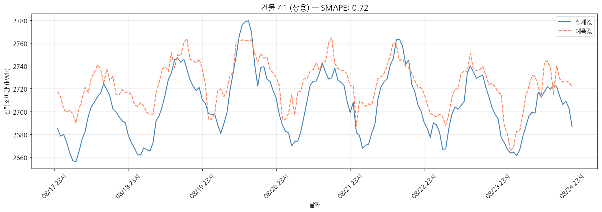
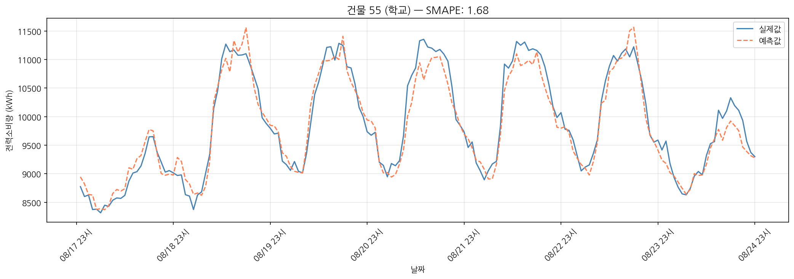
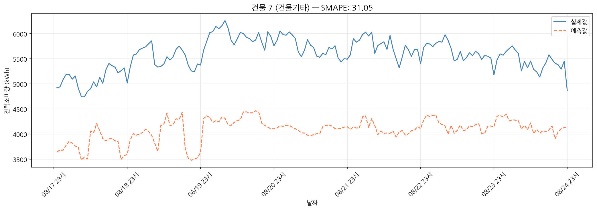

# AI를 활용한 전력사용량 예측 (Power Usage Prediction)

본 프로젝트는 종료된 경진대회를 연구 목적으로 재현한 포트폴리오입니다.  
경진대회 제출이 아닌 단계별 실험을 통한 성능 개선 과정을 기록했습니다.

---

## 프로젝트 개요

### 배경
안정적이고 효율적인 에너지 공급을 위해 전력 사용량 예측의 중요성이
갈수록 커지고 있습니다. 본 프로젝트는 건물의 전력사용량 데이터와
기상 데이터를 활용하여 전력 사용량을 예측하는 AI 모델을 개발합니다.
자세한 내용은 [DACON 2025 전력사용량 예측 AI 경진대회](https://dacon.io/competitions/official/236531/overview/description)
을 통해 확인할 수 있습니다.

### 목표
- 건물의 전력사용량 예측 AI 모델 개발
- 단계별 실험을 통한 성능 개선 과정 기록
- 트리 기반 모델과 딥러닝 모델 비교 분석

### 평가 지표
**SMAPE (Symmetric Mean Absolute Percentage Error)**

$$SMAPE = \frac{1}{n}\sum_{i=1}^{n}\frac{2|y_i - \hat{y}_i|}{|y_i| + |\hat{y}_i|} \times 100$$

- 예측값과 실제값의 상대 오차를 측정하는 지표
- 값이 낮을수록 좋음


### 개발 환경
- Python 3.10
- Google Colab (CPU) & (A100)
- Google Drive (데이터 저장)

---

## 데이터 설명

> 데이터는 용량 및 저작권 문제로 저장소에 포함되지 않습니다.  
> [DACON 2025 전력사용량 예측 AI 경진대회](https://dacon.io/competitions/official/236531/overview/description)을 통해 확인할 수 있습니다.

### 사용한 데이터

| 파일 | 설명 | 기간 | 크기 |
|------|------|------|------|
| train.csv | 100개 건물 전력소비량 + 기상 데이터 | 2024.06.01 ~ 08.24 | 204,000행 |
| building_info.csv | 건물 유형, 면적, 태양광/ESS 용량 | - | 100행 |

### 컬럼 설명

**train.csv**

| 컬럼 | 설명 |
|------|------|
| num_date_time | 건물번호 + 시간 ID |
| 건물번호 | 1~100 |
| 일시 | 날짜 + 시간 (문자열, 예: 20240601 00) |
| 기온(°C) | 기온 |
| 강수량(mm) | 강수량 |
| 풍속(m/s) | 풍속 |
| 습도(%) | 습도 |
| 일조(hr) | 일조 시간 |
| 일사(MJ/m2) | 일사량 |
| 전력소비량(kWh) | 예측 대상 |

**building_info.csv**

| 컬럼 | 설명 |
|------|------|
| 건물번호 | 1~100 |
| 건물유형 | 10개 유형 |
| 연면적(m2) | 건물 전체 면적 |
| 냉방면적(m2) | 냉방 가능 면적 |
| 태양광용량(kW) | 없으면 '-' |
| ESS저장용량(kWh) | 없으면 '-' |
| PCS용량(kW) | 없으면 '-' |

### 건물 유형 분포

| 유형 | 건물 수 |
|------|---------|
| 백화점 | 16 |
| 호텔 | 10 |
| 상용 | 10 |
| 학교 | 10 |
| 건물기타 | 10 |
| 병원 | 9 |
| 아파트 | 9 |
| 연구소 | 9 |
| IDC(전화국) | 9 |
| 공공 | 8 |

---

## 프로젝트 구조

```
power_forecast/
│
├── data/                          # 데이터 파일 (깃허브 미포함)
│   ├── train.csv                  # DACON에서 다운로드
│   ├── building_info.csv          # DACON에서 다운로드
│   └── train_fe.csv               # step2 실행 후 생성됨
│
├── images/                        # 실제값 vs 예측값 비교 그래프
│   ├── building_35_IDC(전화국).png
│   ├── building_41_상용.png
│   ├── building_55_학교.png
│   └── building_7_건물기타.png
│
├── results/                       # 실험 결과 기록
│   └── experiment_results.csv     # 각 실험별 SMAPE 및 개선폭 누적 기록
│
├── notebooks/
│   ├── step1_eda.ipynb
│   ├── step2_feature_engineering.ipynb
│   ├── step3_modeling.ipynb
│   ├── step4_hyperparameter_tuning.ipynb
│   ├── step5_building_level_modeling.ipynb
│   ├── step6_outlier_analysis.ipynb
│   ├── step7_ensemble.ipynb
│   └── step8_lstm.ipynb
│
└── README.md
```

### experiment_results.csv 설명

각 실험마다 결과를 누적해서 기록한 파일입니다.

| 컬럼 | 설명 |
|------|------|
| 실험번호 | 0(Baseline)부터 순서대로 |
| 실험명 | 실험 내용 요약 |
| SMAPE | 검증 데이터 기준 SMAPE |
| 개선폭 | 이전 실험 대비 SMAPE 변화량 (음수면 개선) |
| 비고 | 사용한 파라미터, 전략 등 상세 내용 |

---

## STEP 1. EDA

데이터를 탐색하고 이후 모든 결정의 근거가 되는 패턴을 발견했습니다.

### 데이터 기본 구조

```
train: 2024.06.01 ~ 08.24 (85일)  204,000행
100개 건물 × 24시간 = 하루 2,400행
결측치: 없음 (building_info의 '-' 제외)
```

### 핵심 발견 4가지

**발견 1. 건물 유형 간 전력 규모가 최대 9.3배 차이**

| 유형 | 평균 전력소비량(kWh) |
|------|---------------------|
| IDC(전화국) | 10,317 |
| 병원 | 4,454 |
| 학교 | 3,463 |
| 호텔 | 3,175 |
| 백화점 | 2,730 |
| 상용 | 2,514 |
| 건물기타 | 2,286 |
| 연구소 | 2,112 |
| 공공 | 1,626 |
| 아파트 | 1,106 |

→ 단일 모델로 모든 유형을 학습하면
  절대적 스케일 차이로 인해 오차가 커짐  
→ **유형별 모델 분리의 근거**

---

**발견 2. 유형마다 시간대 전력 패턴이 완전히 다름**

| 유형 | 시간대 패턴 |
|------|-------------|
| IDC(전화국) | 24시간 수평 (약 10,000 kWh 유지) |
| 백화점 | 영업시간(10시~21시)에만 급등 |
| 학교 | 수업시간(8시~17시)에만 높음 |
| 병원 | 오전 11시~오후 5시 피크 |
| 아파트 | 저녁 시간대 소폭 상승 |

→ 하나의 모델이 이 모든 패턴을 동시에 학습하는 것은
  구조적으로 어려움  
→ **hour_sin, hour_cos feature 추가 근거**  
→ **유형별 모델 분리의 두 번째 근거**

---

**발견 3. 주말 영향 방향이 유형마다 반대**

| 그룹 | 유형 | 주말/평일 비율 |
|------|------|----------------|
| 주말 감소 | 연구소 | 0.70 |
| | 공공 | 0.76 |
| | 학교 | 0.82 |
| | 병원 | 0.83 |
| | 상용 | 0.87 |
| 주말 무관 | IDC | 0.98 |
| 주말 증가 | 백화점 | 1.02 |
| | 아파트 | 1.05 |
| | 호텔 | 1.06 |

→ 같은 is_weekend feature가 유형마다 반대 방향으로 작용  
→ 전체 단일 모델에서는 패턴이 상충됨  
→ **is_weekend feature 추가 근거**  
→ **유형별 모델 분리의 세 번째 근거**

---

**발견 4. 26°C 이상에서 전력 급증**

기온 구간별 평균 전력소비량 분석 결과,
26°C를 기점으로 전력 증가 속도가 뚜렷하게 빨라지는 것을 확인

→ **CDH(냉방도시) 기준 온도 26°C 설정 근거**

---

## STEP 2. Feature Engineering

EDA에서 발견한 4가지를 근거로 feature를 설계했습니다.

### Feature 목록

| 종류 | Feature | 추가 근거 |
|------|---------|-----------|
| 시간 변환 | month, day, hour, weekday | 문자열 → 숫자 변환 |
| 주기성 인코딩 | hour_sin, hour_cos | 23시↔0시 거리 문제 해결 |
| 주기성 인코딩 | weekday_sin, weekday_cos | 일↔월 거리 문제 해결 |
| 주말 여부 | is_weekend | 발견 3: 주말 영향 방향 차이 |
| 불쾌지수 | THI | 기온+습도 조합이 냉방 수요를 더 잘 설명 |
| 냉방도시 | CDH | 발견 4: 26°C 이상 전력 급증 |
| IDC 플래그 | is_IDC | 발견 2: IDC 패턴이 완전히 다름 |
| 설비 여부 | has_solar, has_ess | 태양광/ESS 보유 건물은 순소비량 다름 |
| 건물별 통계 | building_hour_mean | 건물의 평소 시간대별 소비량 |
| 건물별 통계 | building_weekday_mean | 건물의 평소 요일별 소비량 |
| 건물별 통계 | building_mean | 건물의 전체 평균 소비량 |
| 건물 정보 | 연면적, 냉방면적 등 | building_info 병합 |

**Feature 수: 10개 → 28개**

### 주요 파생 변수 공식

**THI (불쾌지수)**

$$THI = 0.81T + 0.01 \times RH \times (0.99T - 14.99) + 46.3$$

같은 기온이라도 습도가 높으면 냉방 수요가 더 높아짐

**CDH (냉방도시)**

$$CDH = \max(T - 26, 0)$$

26°C 이하에서는 냉방 수요가 거의 없고
초과하는 순간부터 선형적으로 증가하는 특성 반영

---

## STEP 3. Modeling

### 실험 설계 원칙

변수를 하나씩 바꿔가며 각 변경의 효과를 독립적으로 측정

### 검증 데이터 분리 방법

```
시계열 데이터이므로 랜덤 분할 사용 불가
→ 날짜 기준으로 분리

학습: 2024.06.01 ~ 08.17
검증: 2024.08.18 ~ 08.24 (마지막 7일)
```

### 실험 결과

| 실험 | 변경 사항 | SMAPE | 개선폭 |
|------|-----------|-------|--------|
| Baseline | 대회 제공 XGBoost | 24.01 | - |
| 실험 1 | Feature Engineering 추가 (XGBoost) | 8.42 | -15.59 |
| 실험 2 | LightGBM으로 교체 | 9.39 | +0.97 |
| 실험 3 | 건물 유형별 모델 분리 (XGBoost) | 7.26 | -1.16 |

### 주요 발견

**Feature Engineering의 효과가 압도적**
- Baseline 대비 SMAPE 15.59 감소
- building_hour_mean 등 건물별 통계 feature가 핵심 역할

**LightGBM이 XGBoost보다 나쁜 결과**
- 일반적으로 LightGBM이 XGBoost보다 우수하다고 알려져 있지만
  이 데이터에서는 XGBoost가 더 좋은 성능을 보임
- 모델 선택은 이론이 아닌 실험으로 결정해야 함을 확인

**유형별 모델 분리의 효과**
- EDA에서 발견한 유형별 패턴 차이가 실제 성능 개선으로 이어짐
- 단일 모델 대비 SMAPE 1.13 개선

---

## STEP 4. Hyperparameter Tuning

XGBoost 파라미터를 조정하여 추가 성능 개선을 시도했습니다.

### 탐색 방법

전체 모델 기준으로 파라미터 조합을 탐색한 뒤
최적 파라미터를 유형별 모델에 적용

### 파라미터 조합별 결과

| 조합 | max_depth | min_child_weight | subsample | SMAPE |
|------|-----------|-----------------|-----------|-------|
| 1 | 4 | 5 | 0.8 | 10.03 |
| 2 | 6 | 3 | 0.8 | 8.39 |
| **3** | **8** | **1** | **0.9** | **7.51** |

**최적 파라미터**
```
max_depth=8, min_child_weight=1,
subsample=0.9, colsample_bytree=0.9
```

트리 깊이가 깊을수록 성능이 향상됨  
→ 건물 유형, 시간대, 기상 조건이 복잡하게 상호작용하는
  데이터 특성상 깊은 트리가 적합

**유형별 모델에 최적 파라미터 적용 결과: SMAPE 6.89**

---

## STEP 5. Building-level Modeling

유형별(10개 모델) → 건물별(100개 모델)로 더 세분화했습니다.

### 결과

| 모델 | 학습 단위 | SMAPE |
|------|-----------|-------|
| 유형별 모델 (실험 4) | 유형당 평균 18,000행 | 6.89 |
| 건물별 모델 (실험 5) | 건물당 1,872행 | 7.03 |

**건물별 모델이 유형별보다 오히려 악화됨**

### 원인 분석

```
건물당 학습 데이터: 1,872행
→ XGBoost가 복잡한 패턴을 학습하기에 부족
→ 과적합(Overfitting) 발생
```

> 세분화할수록 항상 성능이 좋아지는 것은 아니며  
> 데이터 양과 모델 복잡도의 트레이드오프가 존재함

---

## STEP 6. Outlier Analysis

실험 5에서 특정 건물의 예측이 크게 실패한 원인을
시각화와 수치 분석으로 파악했습니다.

### 예측이 어려운 건물 분석

| 건물 | 유형 | SMAPE | 원인 |
|------|------|-------|------|
| 7 | 건물기타 | 45.99 | 7월 초 운영 패턴 급변 |
| 94 | 연구소 | 26.37 | 8월 초 단기 급락 |
| 10 | 호텔 | 25.50 | 7월 중순 성수기 패턴 변화 |
| 61 | 건물기타 | 18.11 | 전반적 변동폭 큼 |
| 54 | 백화점 | 17.23 | 일시적 급락 2~3회 |

### 핵심 발견

**IQR 3배 기준 이상치: 모든 건물 0개**

예측 실패의 원인이 이상치(Outlier)가 아닌
**패턴 변화(Regime Change)** 였음

```
건물 7: 학습 구간에서 전력 수준이
        4,000 → 1,000 → 5,000 kWh로 두 번 급변
        모델이 평균적인 값을 학습해서
        검증 구간 예측에 실패
```

### 결론

패턴 변화가 있는 건물은 현재 모델 구조로는 예측하기 어려움  
건물 운영 일정, 행사 정보 같은 **외부 데이터가 있어야 개선 가능**

---

## STEP 7. Ensemble

유형별 모델(실험 4)과 건물별 모델(실험 5)의
예측값을 가중평균으로 결합했습니다.

### 앙상블 설계 근거

```
유형별 모델               건물별 모델
─────────────             ─────────────
데이터 충분               건물 고유 패턴 반영
안정적                    데이터 적어 불안정
유형 공통 패턴 학습        개별 특성 반영
        ↓
    서로의 단점을 보완
    단일 모델보다 안정적인 예측 기대
```

### 가중치 탐색 결과

| 유형별 가중치 | 건물별 가중치 | SMAPE |
|--------------|--------------|-------|
| 0.1 | 0.9 | 6.93 |
| 0.2 | 0.8 | 6.85 |
| 0.3 | 0.7 | 6.79 |
| 0.4 | 0.6 | 6.75 |
| 0.5 | 0.5 | 6.73 |
| **0.6** | **0.4** | **6.73** ← 최적 |
| 0.7 | 0.3 | 6.75 |
| 0.8 | 0.2 | 6.78 |
| 0.9 | 0.1 | 6.83 |

**최적 앙상블 SMAPE: 6.73**

유형별 모델에 더 높은 가중치(0.6)를 줬을 때 최적  
→ 유형별 모델이 더 안정적이라는 것이 가중치로도 확인됨

### 실제값 vs 예측값 비교

**건물 35 (IDC) — SMAPE: 0.40**
.png)

패턴과 수준 모두 정확히 예측  
IDC는 24시간 일정한 패턴이라 모델이 가장 잘 학습한 유형

---

**건물 41 (상용) — SMAPE: 0.72**


전반적인 패턴은 정확히 따라가며 수준도 잘 맞음  
예측값이 실제값보다 소폭 높게 편향되는 경향 있음

---

**건물 55 (학교) — SMAPE: 1.68**


주간 피크 패턴을 잘 따라감  
피크 강도를 약간 과대 추정하는 경향 있음

---

**건물 7 (건물기타) — SMAPE: 31.05**


실제값(5,000 ~ 6,000 kWh)과 예측값(3,500 ~ 4,500 kWh)이
완전히 분리되어 있음

STEP 6에서 발견한 패턴 변화(Regime Change)가
실제 예측 오차로 이어지는 것을 시각적으로 확인  
→ 건물 운영 방식 변화 같은 외부 정보 없이는
  현재 모델 구조로 개선하기 어려움

---

## STEP 8. LSTM

트리 모델의 한계를 딥러닝으로 극복할 수 있는지 실험했습니다.

### 트리 모델의 한계

1. 시간 순서를 직접 학습하지 못함
   (hour_sin, hour_cos 등으로 간접 표현)
2. 패턴 변화(Regime Change)에 취약
3. 건물별 모델에서 데이터 부족 문제

### LSTM 모델 구조

```
입력: 과거 24시간의 feature 시퀀스
      (SEQ_LEN=24, feature 수=26)
        트리 모델과 달리 hour_sin, hour_cos 제외
        LSTM이 시간 순서를 직접 학습하므로 불필요
        ↓
LSTM Layer (hidden_size=64, num_layers=2)
        ↓
Fully Connected Layer
        ↓
출력: 다음 1시간 전력소비량
```

건물 100개 각각 개별 LSTM 학습

### 결과

| 모델 | SMAPE |
|------|-------|
| XGBoost 유형별 (실험 4) | 6.89 |
| 앙상블 (실험 7) | 6.73 |
| **LSTM (실험 8)** | **9.06** |

**LSTM이 트리보다 성능이 낮은 이유**

```
건물당 학습 데이터: 1,872행 (3개월치)

트리 모델                    LSTM
─────────────                ─────────────────
행 단위로 학습               시퀀스 단위로 학습
1,872행 전부 활용            1,848개 시퀀스
적은 데이터에 강함           많은 데이터가 필요
```

이 데이터는 3개월치로 LSTM이 장기 패턴
(계절성, 연간 주기)을 학습하기에 부족함

> 만약 1년 이상의 데이터가 있었다면  
> 계절성, 연간 주기 등 장기 패턴을 학습하여  
> LSTM이 더 효과적이었을 것으로 예상

---

## 실험 결과 요약

| 실험 | 설명 | SMAPE | 개선폭 |
|------|------|-------|--------|
| Baseline | 대회 제공 XGBoost | 24.01 | - |
| 실험 1 | Feature Engineering + XGBoost | 8.42 | -15.59 |
| 실험 2 | LightGBM 교체 | 9.39 | +0.97 |
| 실험 3 | 건물 유형별 모델 분리 | 7.26 | -1.16 |
| 실험 4 | Hyperparameter Tuning | 6.89 | -0.37 |
| 실험 5 | Building-level Modeling | 7.03 | +0.14 |
| 실험 6 | Outlier Analysis | - | - |
| **실험 7** | **Ensemble** | **6.73** | **-0.16** |
| 실험 8 | LSTM | 9.06 | - |

**최종 성능: SMAPE 6.73**

---

## 결론 및 한계점

### 결론

**1. Feature Engineering이 가장 중요**

EDA에서 발견한 패턴을 feature로 설계했을 때
SMAPE가 24.01 → 8.42로 가장 크게 개선됨  
특히 building_hour_mean 같은 건물별 통계 feature가
가장 큰 역할을 했음

**2. 유형별 모델 분리가 효과적**

건물 유형마다 시간대 패턴과 주말 영향 방향이 달라
유형별로 개별 모델을 학습하는 것이 유효함  
단일 모델 대비 SMAPE 1.16 개선

**3. 앙상블로 안정성 확보**

유형별 모델(안정적)과 건물별 모델(고유 패턴 반영)의
가중평균이 단일 모델보다 안정적인 예측을 제공

**4. 데이터 양이 모델 선택을 결정**

건물당 데이터가 1,872행으로 적어
LSTM보다 트리 기반 모델이 더 적합함  
모델 선택은 이론이 아닌 데이터 특성에 따라 결정해야 함

### 한계점

**1. 패턴 변화(Regime Change) 대응 불가**

건물 운영 방식이 중간에 바뀌는 경우
현재 모델로는 예측하기 어려움  
건물 운영 일정, 공사 여부 같은 외부 데이터가 필요함

**2. 단기 데이터의 한계**

3개월 데이터로는 계절성, 연간 주기 등
장기 패턴 학습이 불가능함  
1년 이상 데이터가 있으면 LSTM 성능 개선 기대


### 개선 방향

- 단기: 건물별 외부 정보 수집 (공휴일, 행사 일정)

- 중기: 1년 이상 데이터 확보 후 LSTM 재실험

- 장기: 건물 운영 정보 실시간 연동
      

